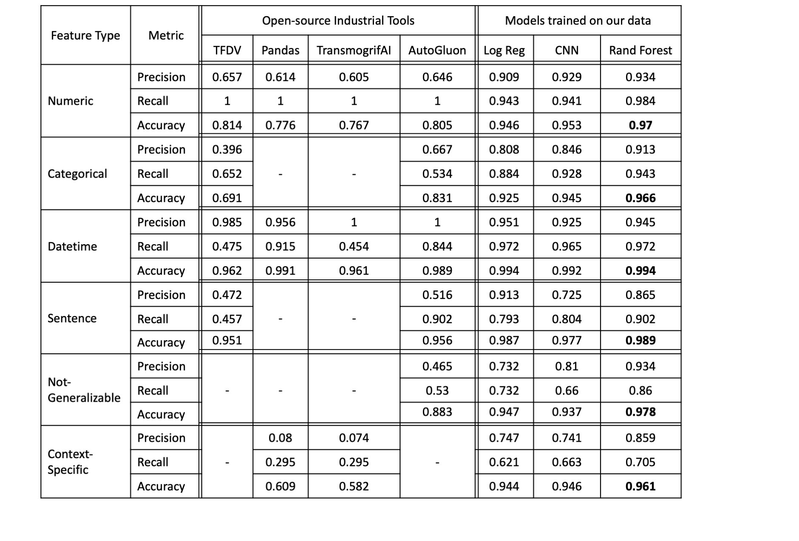
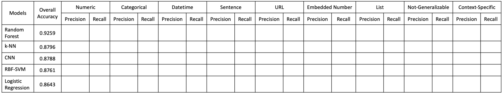

# Task: ML Feature Type Inference

This [project](https://adalabucsd.github.io/sortinghat.html) is about inferring ML feature types over tabular data. Please refer to our [paper](https://adalabucsd.github.io/papers/2021_SortingHat_SIGMOD.pdf) and [tech report](https://adalabucsd.github.io/papers/TR_2021_SortingHat.pdf) for more details.

## Changelog

`03/31/21`: Release `t1v2.0.` Corrected 32 examples in our labeled dataset.

## Benchmark Labeled Data

Benchmark-Labeled-Data/ contains our labeled dataset with the train/test partitions, corresponding metadata, raw CSV files, and our base featurization for ML models.

## Source code

Models/ contain the source code (jupyter notebooks) of different ML models and the apis we use to benchmark feature type inference for AutoML platforms.

## Pre-trained Models

Pre-trained Models/ contain the trained ML models ready for inference.

## Library

Library/ contain our models and featurization routines wrapped under functions in a Python library. It explains how to load the pre-trained models for inference. Install dependencies with `pip install -r requirements.txt`

## Downstream Benchmark

Downstream-Benchmark/ contain links to the datasets, their source details, and downstream model source code

## AutoML Benchmark

The following table presents the binarized class-specific accuracy, precision, and recall of different approaches on our **benchmark labeled held-out test dataset.**

|      Feature Type     |      Metric      |      TFDV    |     Pandas    |     TransmogrifAI    |     AutoGluon    |     Log Reg    |      CNN     |     Rand   Forest    |
|:---------------------:|:----------------:|:------------:|:-------------:|:--------------------:|:----------------:|:--------------:|:------------:|:--------------------:|
|         Numeric       |     Precision    |      0.64    |      0.615    |         0.605        |       0.648      |       0.91     |     0.892    |         0.936        |
|                       |       Recall     |       1      |        1      |           1          |         1        |      0.931     |     0.977    |         0.987        |
|                       |      Accuracy    |     0.799    |      0.777    |         0.767        |       0.807      |      0.943     |      0.95    |         0.971        |
|                       |                  |              |               |                      |                  |                |              |                      |
|       Categorical     |     Precision    |     0.414    |        -      |           -          |       0.703      |      0.826     |     0.875    |          0.91        |
|                       |       Recall     |     0.643    |               |                      |       0.534      |      0.891     |     0.888    |         0.954        |
|                       |      Accuracy    |     0.708    |               |                      |       0.841      |      0.931     |     0.945    |         0.968        |
|                       |                  |              |               |                      |                  |                |              |                      |
|        Datetime       |     Precision    |     0.972    |      0.956    |           1          |         1        |      0.985     |     0.957    |         0.986        |
|                       |       Recall     |     0.489    |      0.915    |         0.454        |       0.887      |      0.957     |     0.957    |         0.972        |
|                       |      Accuracy    |     0.963    |      0.991    |         0.961        |       0.992      |      0.996     |     0.994    |         0.997        |
|                       |                  |              |               |                      |                  |                |              |                      |
|        Sentence       |     Precision    |     0.475    |        -      |           -          |       0.512      |      0.882     |     0.871    |         0.899        |
|                       |       Recall     |     0.511    |               |                      |       0.913      |      0.728     |     0.804    |          0.87        |
|                       |      Accuracy    |     0.951    |               |                      |       0.956      |      0.983     |     0.985    |         0.989        |
|                       |                  |              |               |                      |                  |                |              |                      |
|     Not-Generalizable |     Precision    |       -      |        -      |           -          |        0.45      |      0.709     |     0.714    |         0.946        |
|                       |       Recall     |              |               |                      |        0.54      |      0.726     |     0.777    |         0.888        |
|                       |      Accuracy    |              |               |                      |       0.879      |      0.938     |     0.942    |         0.982        |
|                       |                  |              |               |                      |                  |                |              |                      |
|      Context-Specific |     Precision    |       -      |      0.074    |         0.068        |         -        |       0.72     |     0.848    |         0.852        |
|                       |       Recall     |              |      0.281    |         0.276        |                  |      0.638     |     0.514    |         0.714        |
|                       |      Accuracy    |              |      0.606    |         0.579        |                  |      0.943     |     0.946    |         0.962        |
|                       |                  |              |               |                      |                  |                |              |                      |

<!--  -->

## Leaderboard on our Labeled Data

We invite researchers and practitioners to use our datasets and contribute to create better featurizations and models. By submitting results, you acknowledge that your holdout test results (data_test.csv) are obtained purely by training on the training set (data_train.csv).

<!--  -->

|                    Approaches                   |     9-class   Accuracy    |         |      Numeric     |               |         |     Categorical    |               |         |      Datetime    |               |         |      Sentence    |               |         |        URL       |               |         |     Embedded   Number    |               |         |        List      |               |         |     Not-Generalizable    |               |         |     Context-Specific    |               |         |
|:-----------------------------------------------:|:-------------------------:|:-------:|:----------------:|:-------------:|:-------:|:------------------:|:-------------:|:-------:|:----------------:|:-------------:|:-------:|:----------------:|:-------------:|:-------:|:----------------:|:-------------:|:-------:|:------------------------:|:-------------:|:-------:|:----------------:|:-------------:|:-------:|:------------------------:|:-------------:|:-------:|:-----------------------:|:-------------:|:-------:|
|                                                 |                           |         |     Precision    |     Recall    |         |      Precision     |     Recall    |         |     Precision    |     Recall    |         |     Precision    |     Recall    |         |     Precision    |     Recall    |         |         Precision        |     Recall    |         |     Precision    |     Recall    |         |         Precision        |     Recall    |         |         Precision       |     Recall    |         |
|        [Random   Forest (Shah et al. 2021)](https://adalabucsd.github.io/papers/TR_2021_SortingHat.pdf)       |           0.9265          |         |       0.936      |      0.987    |         |         0.91       |      0.954    |         |       0.986      |      0.972    |         |       0.899      |      0.87     |         |         1        |      0.969    |         |           0.919          |      0.919    |         |       0.956      |      0.754    |         |           0.946          |      0.888    |         |           0.852         |      0.714    |         |
|             [CNN   (Shah et al. 2021)](https://adalabucsd.github.io/papers/TR_2021_SortingHat.pdf)            |           0.8801          |         |       0.892      |      0.977    |         |        0.875       |      0.888    |         |       0.957      |      0.957    |         |       0.871      |      0.804    |         |       0.958      |      0.719    |         |           0.894          |      0.939    |         |         1        |      0.807    |         |           0.714          |      0.777    |         |           0.848         |      0.514    |         |
|           [RBF-SVM   (Shah et al. 2021)](https://adalabucsd.github.io/papers/TR_2021_SortingHat.pdf)          |           0.8736          |         |       0.928      |      0.955    |         |        0.828       |      0.908    |         |       0.978      |      0.965    |         |       0.817      |      0.63     |         |       0.966      |      0.875    |         |           0.919          |      0.919    |         |       0.613      |      0.86     |         |           0.854          |      0.735    |         |           0.805         |      0.67     |         |
|     [k-NN (Shah et al. 2021)](https://adalabucsd.github.io/papers/TR_2021_SortingHat.pdf)                |             0.8796           |   |       0.946      |      0.94     |   |        0.874       |      0.884    |   |       0.914      |      0.952    |   |       0.841      |      0.796    |   |         1        |      0.909    |   |           0.842          |      0.885    |   |        0.87      |      0.769    |   |           0.838          |      0.801    |   |           0.681         |      0.722    |   |
|     [Logistic   Regression (Shah et al. 2021)](https://adalabucsd.github.io/papers/TR_2021_SortingHat.pdf)    |           0.8584          |         |        0.91      |      0.931    |         |        0.826       |      0.891    |         |       0.985      |      0.957    |         |       0.882      |      0.728    |         |       0.968      |      0.938    |         |           0.947          |      0.909    |         |       0.935      |      0.754    |         |           0.709          |      0.726    |         |           0.72          |      0.638    |         |
